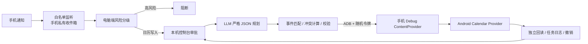

# Quiet Calendar Agent

在用户继续使用同一台安卓手机时，从通知提取日历任务，经电脑端确认后在手机后台执行、回读和撤销。已在华为 Mate 40 Pro / HarmonyOS 4.2 验证通知采集与后台日历事务；通知到模型执行的完整链路仍需携带有效 API Key 做最终演练。

**选择理由：**日历由系统数据接口在后台修改，不模拟触屏，因此不占用用户的焦点和键盘。华为实测后台广播受限，演示版改用同步 ContentProvider；它仅存在于 debug APK。模型只生成计划，执行器负责唯一事件匹配、冲突判断、写前校验和回滚。当前只支持 Agent 标记的事件，不能声称适配所有手机或任意 App。

## 本地部署

1. 安装 JDK 17、Android SDK Platform/Build Tools 35、Platform Tools 和 Python 3；设置下表环境变量。运行 `./gradlew :app:assembleDebug`。
2. USB 连接已开启调试的安卓手机；用 `adb devices -l` 确认，再运行 `adb -d install -r app/build/outputs/apk/debug/app-debug.apk`。打开 App 一次，授予日历及通知使用权，随后切回聊天应用。
3. 运行 `python3 tools/quiet_cli.py calendars`，选择可写日历 ID。测试通知使用 `python3 tools/notification_bridge.py configure com.android.shell`；真实来源需改成该 App 的包名。
4. 先用 `python3 tools/quiet_cli.py create --task-id readme-seed-1 --calendar-id 1 --title "客户复盘" --start "2026-09-24T14:00:00+10:00" --minutes 30` 创建测试会议。启动控制台前，在同一终端设置 `OPENAI_API_KEY`、`OPENAI_MODEL=gpt-5-mini`；运行 `python3 tools/control_center.py --calendar-id 1 --open`。另开终端用 `python3 tools/notification_bridge.py test --text "把2026年9月24日14点的客户复盘改到2026年9月25日16点；若冲突找之后最近空档，提前20分钟提醒，并在会后创建30分钟整理会议纪要"` 发送通知。日历 ID 和日期需按当前测试环境替换。

| 环境变量 | 用途 |
| --- | --- |
| `JAVA_HOME` | JDK 17；构建 APK 必需 |
| `ANDROID_HOME` | Android SDK 根目录；构建与定位 `adb` |
| `OPENAI_API_KEY` | 自然语言规划所需；仅在本机终端设置，不提交仓库 |
| `OPENAI_MODEL` | 支持 Responses API 结构化输出的模型，例如 `gpt-5-mini` |

控制台仅监听 `127.0.0.1`。更完整的 [安装与演示命令](docs/NOTIFICATION_CONTROL_CENTER.md)、[复合任务与撤销](docs/BATCH_DEMO.md)和 [1–2 分钟演示脚本](docs/DEMO_SCRIPT.md)见 `docs/`。项目是 USB ADB + debug APK 的实机原型；画面是否始终流畅需要以连续实拍验证。
