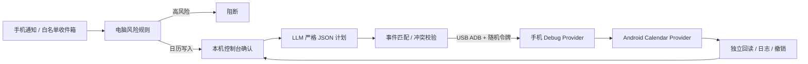

# Quiet Calendar Agent

用户继续使用安卓手机时，Agent 在**同一台手机**后台完成日历改期、冲突避让、提醒与会后任务。已在华为 Mate 40 Pro / HarmonyOS 4.2 完成端到端实机验证：白名单通知进入控制台，经人工确认和模型规划后执行日历事务，会议、提醒与会后事项均独立回读成功，执行期间 Agent 未进入前台。

**选型：**系统日历接口可后台写入，不占用触屏、焦点或键盘。模型只提计划；代码负责匹配、校验、回读和回滚。华为后台广播实测受限，因此演示版采用 debug 专用同步 ContentProvider。

## 本地部署

需要 JDK 17、Android SDK 35（含 Platform/Build Tools、Platform Tools）、Python 3 和已开启 USB 调试的安卓手机。

| 环境变量 | 用途 |
| --- | --- |
| `JAVA_HOME` | JDK 17 路径 |
| `ANDROID_HOME` | Android SDK 根目录 |
| `OPENAI_API_KEY` | 本机终端中的模型密钥 |
| `OPENAI_MODEL` | 支持结构化输出的 Responses 模型，如 `gpt-5-mini` |

1. `./gradlew :app:assembleDebug`；用 `adb devices -l` 确认连接；`adb -d install -r app/build/outputs/apk/debug/app-debug.apk`。
2. 打开 App 授予日历及通知使用权；`python3 tools/quiet_cli.py calendars` 查可写日历 ID。
3. 测试通知：`python3 tools/notification_bridge.py configure com.android.shell`。真实通知应改为来源 App 的包名。
4. 设置模型变量，运行 `python3 tools/control_center.py --calendar-id 1 --open`（替换日历 ID）；按[完整演示命令](docs/NOTIFICATION_CONTROL_CENTER.md)准备会议、发送通知并在电脑上确认。

**范围：**只改动 Agent 标记的事件；高风险阻断，中风险电脑确认。原型依赖 USB ADB/debug APK，未验证所有安卓机或 iOS。回读与前台采样提供证据；流畅性须以连续实拍核验。
